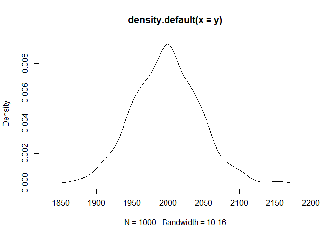

p
================
maor
31 1 2021

``` r
summary(cars)
```

    ##      speed           dist       
    ##  Min.   : 4.0   Min.   :  2.00  
    ##  1st Qu.:12.0   1st Qu.: 26.00  
    ##  Median :15.0   Median : 36.00  
    ##  Mean   :15.4   Mean   : 42.98  
    ##  3rd Qu.:19.0   3rd Qu.: 56.00  
    ##  Max.   :25.0   Max.   :120.00

## Including Plots

You can also embed plots, for example:

``` r
x=rep(0,1000)
y=rep(0,1000)

for (i in seq_along(1:1000)) {
  
  x[i] = mean(rpois(1000,2))
  
  y[i] = sum(rpois(1000,2))
  
}

plot(density(x))
```

<!-- -->

Note that the `echo = FALSE` parameter was added to the code chunk to
prevent printing of the R code that generated the plot.

``` r
plot(density(y))
```

<!-- -->

``` r
x = 4
```
