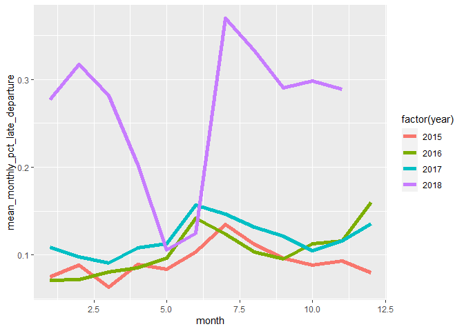
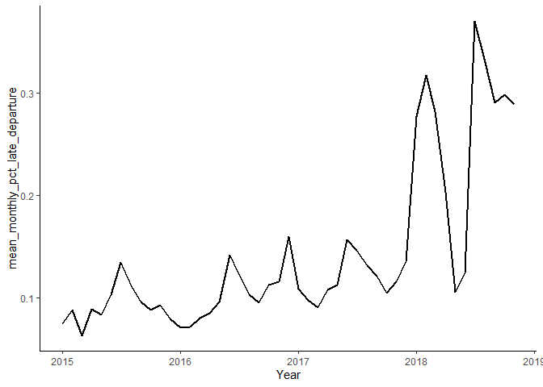
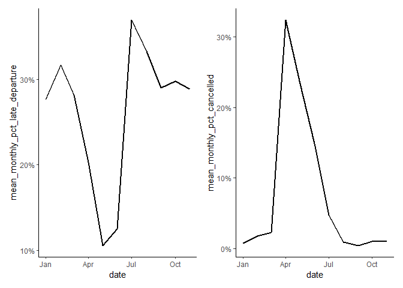
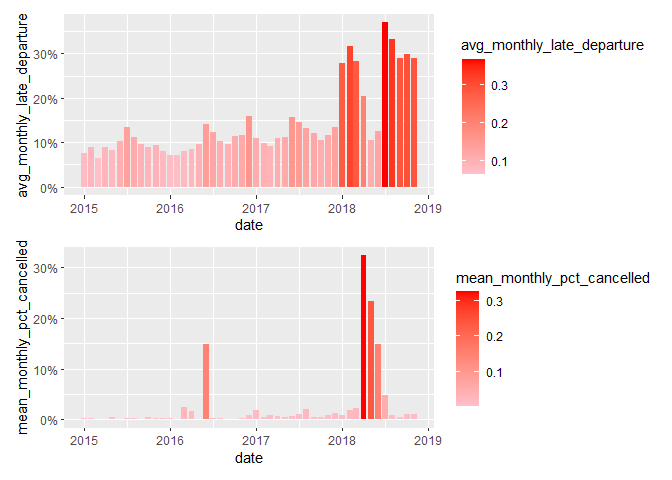
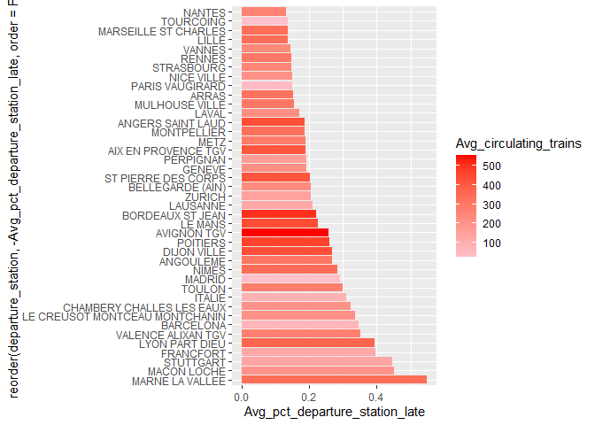
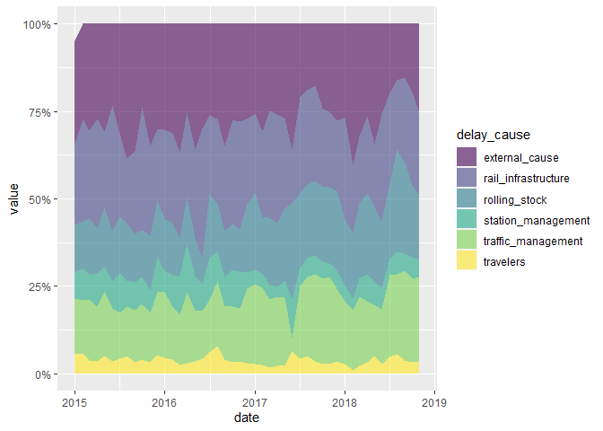
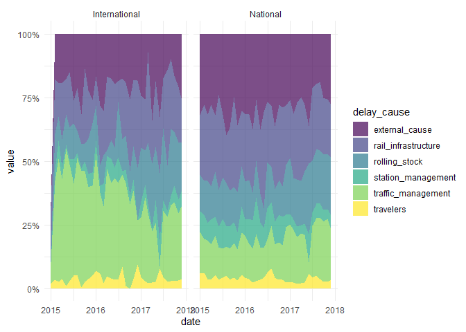
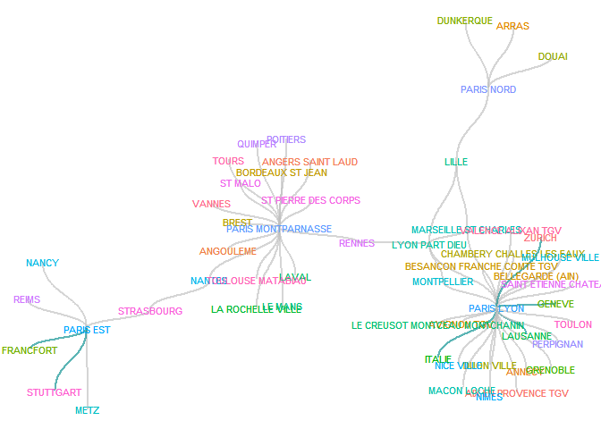

French Trains
================
maor
20 1 2021

``` r
options(scipen = 999)
library(tidyverse)
library(scales)
library(patchwork)
Sys.setlocale("LC_TIME", "C")
```

    ## [1] "C"

``` r
df_raw <- readr::read_csv("https://raw.githubusercontent.com/rfordatascience/tidytuesday/master/data/2019/2019-02-26/full_trains.csv") 
```

Cancellations\delays comments are either blank or in french which sadly I dont know >>> remove them.
``` r


df = df_raw %>%
  select(-c(comment_cancellations,comment_delays_at_departure,comment_delays_on_arrival))

df = df %>%
  mutate(pct_late_departure = num_late_at_departure/total_num_trips,
         mean_monthly_pct_cancelled = num_of_canceled_trains/total_num_trips)  
```

``` r
df %>%
  group_by(arrival_station,departure_station) %>%
      summarize(Count = n()) 
```

    ## `summarise()` has grouped output by 'arrival_station'. You can override using the `.groups` argument.

    ## # A tibble: 130 x 3
    ## # Groups:   arrival_station [59]
    ##    arrival_station            departure_station  Count
    ##    <chr>                      <chr>              <int>
    ##  1 AIX EN PROVENCE TGV        PARIS LYON            47
    ##  2 ANGERS SAINT LAUD          PARIS MONTPARNASSE    47
    ##  3 ANGOULEME                  PARIS MONTPARNASSE    47
    ##  4 ANNECY                     PARIS LYON            47
    ##  5 ARRAS                      PARIS NORD            47
    ##  6 AVIGNON TGV                PARIS LYON            47
    ##  7 BARCELONA                  PARIS LYON            11
    ##  8 BELLEGARDE (AIN)           PARIS LYON            47
    ##  9 BESANCON FRANCHE COMTE TGV PARIS LYON            47
    ## 10 BORDEAUX ST JEAN           PARIS MONTPARNASSE    47
    ## # ... with 120 more rows

``` r
df %>%
  mutate(pct_late_departure = num_late_at_departure/total_num_trips) %>%
  group_by(year,month) %>% 
  summarise(mean_monthly_pct_late_departure = mean(pct_late_departure)) %>% 
  ggplot(aes(month,mean_monthly_pct_late_departure,color = factor(year)))+
    geom_line(size = 2)
```

    ## `summarise()` has grouped output by 'year'. You can override using the `.groups` argument.

<!-- -->

``` r
# intresting, 2018 was though
# But that's quite a messy graph because we need to recode our year varible

df = df %>% mutate(date = as.Date(sprintf("%d-%02d-01",year,month)))

df %>%  
  group_by(date) %>% 
  summarise(mean_monthly_pct_late_departure = mean(pct_late_departure)) %>% 
  ggplot(aes(date,mean_monthly_pct_late_departure,size = 1))+
    theme_classic()+
  xlab("Year")+
  geom_line(size = 1)
```

<!-- -->

``` r
 p1 = df %>% filter(year==2018) %>% 
  group_by(date) %>% 
  summarise(mean_monthly_pct_late_departure = mean(pct_late_departure)) %>% 
  ggplot(aes(date,mean_monthly_pct_late_departure))+
  theme_classic()+
  scale_x_date(date_labels = "%b")+
  scale_y_continuous(labels = percent_format())+
  geom_line(size = 1)
  
  

p2 = df %>% filter(year==2018) %>% 
  group_by(date) %>% 
  summarise(mean_monthly_pct_cancelled = mean(mean_monthly_pct_cancelled)) %>% 
  ggplot(aes(date,mean_monthly_pct_cancelled))+
  theme_classic()+
  scale_x_date(date_labels = "%b")+
  scale_y_continuous(labels = percent_format())+
  geom_line(size = 1)

p1+p2
```

<!-- -->

``` r
 p3 = df %>% 
  group_by(year,date) %>% 
  summarise(avg_monthly_late_departure = mean(pct_late_departure)) %>% 
  ungroup() %>% 
  ggplot(aes(date,avg_monthly_late_departure,fill=avg_monthly_late_departure))+
  scale_fill_gradient(low="pink", high="red")+
  scale_y_continuous(labels = percent_format())+
  geom_bar(stat = "identity")
```

    ## `summarise()` has grouped output by 'year'. You can override using the `.groups` argument.

``` r
p4 = df %>%
  group_by(year,date) %>% 
  summarise(mean_monthly_pct_cancelled = mean(mean_monthly_pct_cancelled)) %>% 
  ggplot(aes(date,mean_monthly_pct_cancelled,fill=mean_monthly_pct_cancelled))+
  scale_fill_gradient(low="pink", high="red")+
  scale_y_continuous(labels = percent_format())+
  geom_bar(stat = "identity")
```

    ## `summarise()` has grouped output by 'year'. You can override using the `.groups` argument.

``` r
p3/p4
```

<!-- -->

``` r
df %>% 
  group_by(departure_station) %>% 
  summarise(Avg_pct_departure_station_late = mean(pct_late_departure),
            Avg_circulating_trains = mean(total_num_trips)) %>% 
  arrange(desc(Avg_pct_departure_station_late)) %>% 
  filter(Avg_pct_departure_station_late>0.1) %>% 
  ggplot(aes(x = reorder(departure_station, -Avg_pct_departure_station_late,order = F), y= Avg_pct_departure_station_late,fill= Avg_circulating_trains))+
  scale_fill_gradient(low='pink', high='red')+
  geom_bar(stat = "identity")+
  coord_flip()
```

<!-- -->

``` r
library(viridis)
```

    ## Loading required package: viridisLite

    ## 
    ## Attaching package: 'viridis'

    ## The following object is masked from 'package:scales':
    ## 
    ##     viridis_pal

``` r
library(hrbrthemes)
```

    ## NOTE: Either Arial Narrow or Roboto Condensed fonts are required to use these themes.

    ##       Please use hrbrthemes::import_roboto_condensed() to install Roboto Condensed and

    ##       if Arial Narrow is not on your system, please see https://bit.ly/arialnarrow

``` r
df %>%  
  group_by(year,month) %>% 
        summarise(across(starts_with("delay_"), mean,na.rm = T)) %>%  
         mutate(date = as.Date(sprintf("%d-%02d-01",year,month))) %>% 
        pivot_longer(cols = starts_with("delay"),names_to = "delay") %>%
        mutate(delay = substring(delay,nchar("delay_cause_")+1)) %>% 
        rename(delay_cause = delay) %>% 
  ggplot(aes(date,value,fill = delay_cause))+
  scale_fill_viridis(discrete = T)+
  geom_area(alpha = 0.6)+
  scale_y_continuous(labels = percent_format())
```

    ## `summarise()` has grouped output by 'year'. You can override using the `.groups` argument.

<!-- -->

``` r
df %>%  
  filter(year != 2018) %>% 
  group_by(year,month,service) %>% 
        summarise(across(starts_with("delay_"), mean,na.rm = T)) %>% 
         mutate(date = as.Date(sprintf("%d-%02d-01",year,month))) %>% 
        pivot_longer(cols = starts_with("delay"),names_to = "delay") %>%
        mutate(delay = substring(delay,nchar("delay_cause_")+1)) %>% 
        rename(delay_cause = delay) %>% 
  ggplot(aes(date,value,fill = delay_cause))+
  scale_fill_viridis(discrete = T)+
  facet_grid(~service) +
  geom_area(alpha = 0.7)+
  scale_y_continuous(labels = percent_format())+
  theme_minimal()
```

    ## `summarise()` has grouped output by 'year', 'month'. You can override using the `.groups` argument.

<!-- -->

``` r
library(igraph)
```

    ## 
    ## Attaching package: 'igraph'

    ## The following objects are masked from 'package:dplyr':
    ## 
    ##     as_data_frame, groups, union

    ## The following objects are masked from 'package:purrr':
    ## 
    ##     compose, simplify

    ## The following object is masked from 'package:tidyr':
    ## 
    ##     crossing

    ## The following object is masked from 'package:tibble':
    ## 
    ##     as_data_frame

    ## The following objects are masked from 'package:stats':
    ## 
    ##     decompose, spectrum

    ## The following object is masked from 'package:base':
    ## 
    ##     union

``` r
library(ggraph)

p1 = df %>% 
  filter(year != 2018) %>% 
  group_by(departure_station,arrival_station,service) %>%
  summarise(avg_journey_time = mean(journey_time_avg)) %>% 
   mutate(id = map2_chr(departure_station, arrival_station,
  ~str_flatten(sort(c(.x,.y))))) %>%       
   group_by(id) %>%
   mutate(avg_route_journey_time = mean(avg_journey_time)) %>% 
  rename(from = departure_station,to = arrival_station) 
```

    ## `summarise()` has grouped output by 'departure_station', 'arrival_station'. You can override using the `.groups` argument.

``` r
p1 = p1[,c(1:3)] 
graph1 = graph.data.frame(p1) 


  ggraph(graph1) +
    geom_node_text(aes(label = name,color = name),size = 3)+
  geom_edge_diagonal(aes(color = factor(service)),alpha = 0.4,width = 1)+
  scale_edge_color_manual(values=c("darkcyan","gray"))+
  geom_node_text(aes(label = name,color = name),size = 3)+
    theme_void()+
    theme(legend.position="none")
```

    ## Using `stress` as default layout

<!-- -->
